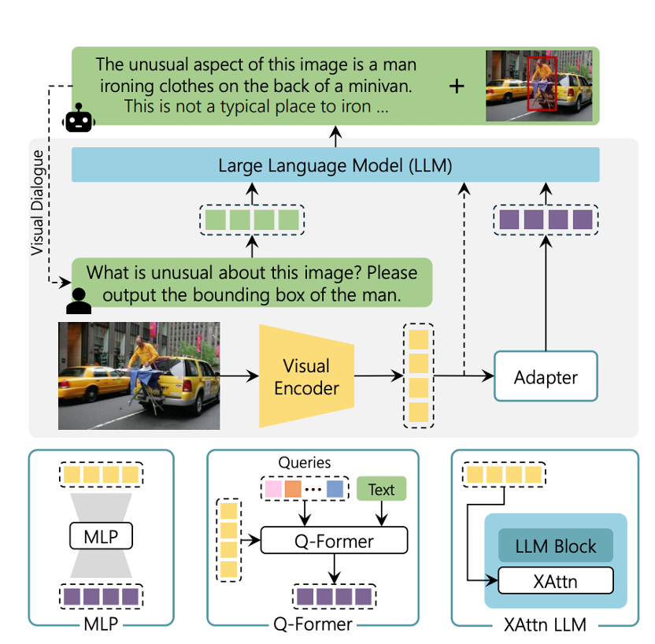
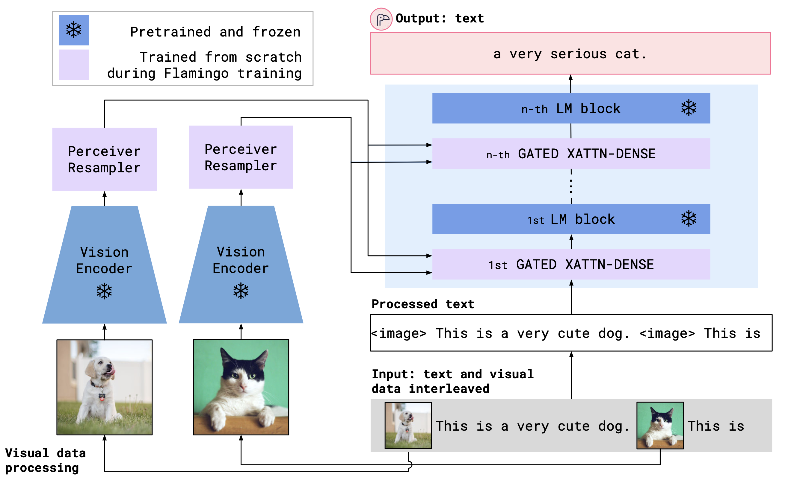
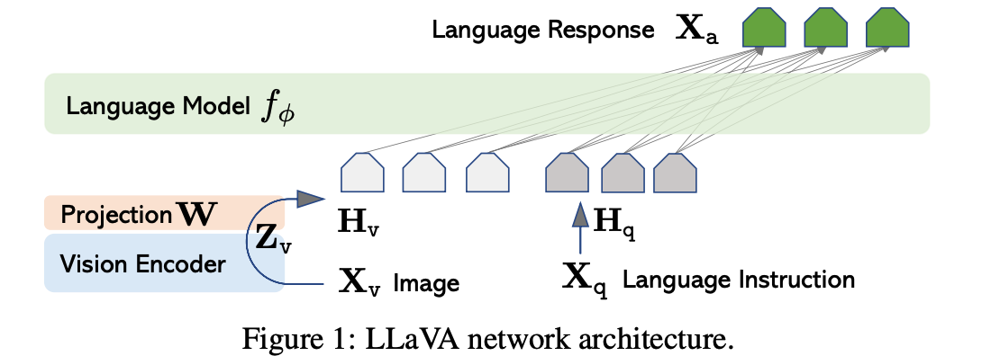
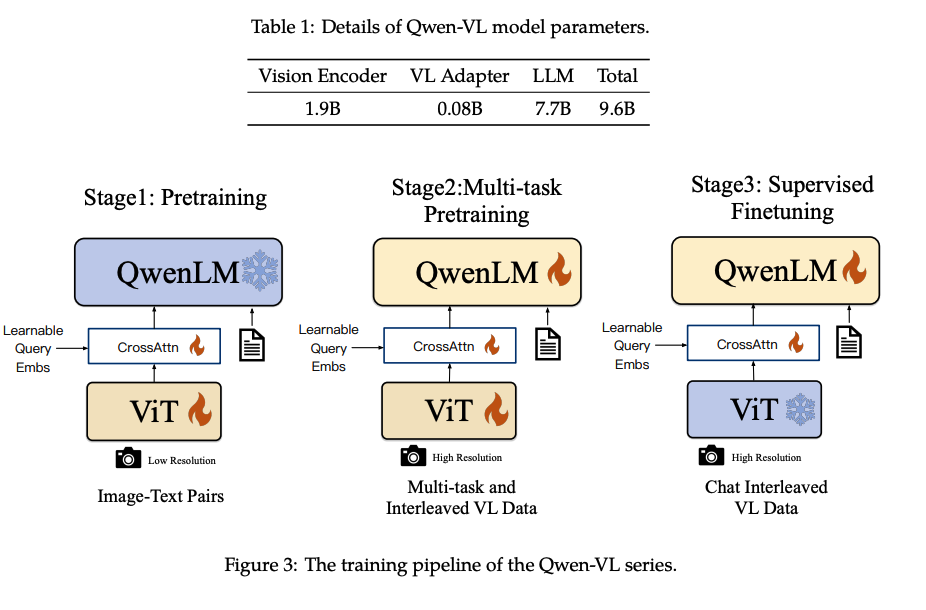
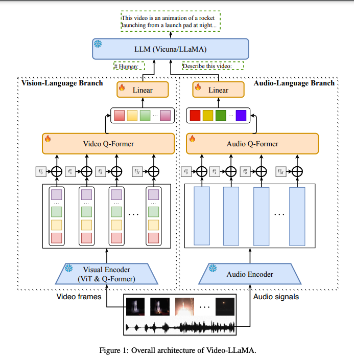
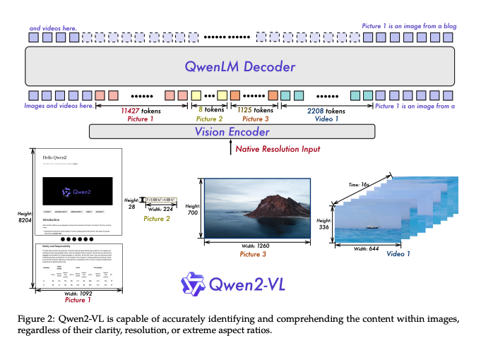
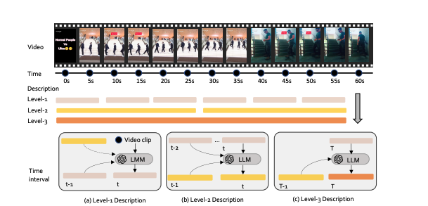
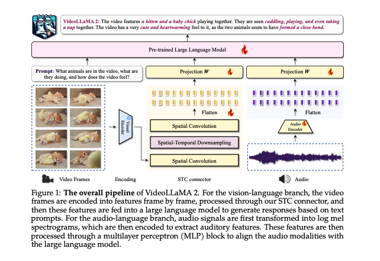
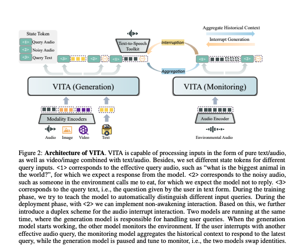

# 多模态大模型调研
多模态大模型（Multimodal Large Models, MLLMs）是能够同时处理和理解多种数据类型（如文本、图像、视频、音频等）的深度学习模型。 根据我们的交通使用场景，主要需要关注两个种类的MLLMS：（1）图像大语言模型 （2）视频大语言模型 

## 图像大语言模型 
**基础架构图**

**典型的模型**
1. **Flamingo:** Flamingo: a Visual Language Model for Few-Shot Learning 
*The pioneering work of multimodal large language model*
   - architecture: 
   - paper: https://arxiv.org/abs/2204.14198 
   - size: 70B 
   - code: https://github.com/mlfoundations/open_flamingo
   - published by **DeepMind**
   - published date : 2022
2. **LLaVA**
*Specially tailored for multi-round dialogue. LLaVA represents a novel end-to-end trained large multimodal model that combines a vision encoder and Vicuna for general-purpose visual and language understanding, achieving impressive chat capabilities mimicking spirits of the multimodal GPT-4 and setting a new state-of-the-art accuracy on Science QA.*
   - architecture:  
   - paper: https://arxiv.org/pdf/2304.08485 
   - size: 13B
   - code: https://huggingface.co/datasets/liuhaotian/LLaVA-Instruct-150K 
   - publish website: https://llava-vl.github.io/ 
   - published by: **Microsoft**
   - published date: 2023
3. **LLaVA-1.5**
*Improve reasoning ability of the original llava*
    - size: 13B
4. **MiniGPT-5** MiniGPT-5: Interleaved Vision-and-Language Generation via Generative Vokens
*It mainly focuse on the improvement of text to image generation*
   - architecture: 
   - paper: https://arxiv.org/abs/2310.02239
   - size: 13B 
   - code: https://github.com/eric-ai-lab/MiniGPT-5 
   - published by: **UCSC**
   - published date: 2023
5. **Qwen-VL** Qwen-VL: A Versatile
Vision-Language Model for Understanding
*Mainly for image understanding, image desription*
   - architecture: 
   - paper: https://arxiv.org/pdf/2308.12966 
   - size: 9.6B
   - code: https://github.com/QwenLM/Qwen-VL
   - published by: "Alibaba Group"
   - published date: 2024

## 视频大语言模型 
**基础架构图** 

**Benchmark**
   - project url: https://video-mme.github.io/ 
   - paper： https://arxiv.org/pdf/2405.21075 
1. **Gemini 1.5 Pro**
   - paper: https://storage.googleapis.com/deepmind-media/gemini/gemini_v1_5_report.pdf
   - code: Not open-sourced
   - published by **Google**
   - published date: 2024-06
   - sample rate: 1 fps

2. **Qwen2-VL**:
   - architecture: 
   - paper: https://arxiv.org/pdf/2409.12191
   - code: https://huggingface.co/spaces/Qwen/Qwen2-VL
   - project url: https://qwenlm.github.io/blog/qwen2-vl/
   - size: 72B
   - published by: **Alibaba**
   - published date: 2024-08
   - sample rate: 2 fps (upper limit 768 frames)

3. **LLaVA-Video** Video Instruction Tuning with Synthetic Data
   - architecture: 
   - project page: https://llava-vl.github.io/blog/2024-09-30-llava-video/ 
   - paper:  https://arxiv.org/pdf/2410.02713
   - code: https://llava-vl.github.io/blog/2024-09-30-llava-video/
   - size: 72B 
   - published by: **Bytedance & NTU**
   - published date: 202408
   - sample rate: total 64 frames
   - 
4. **videoLLAMA2** : VideoLLaMA 2
Advancing Spatial-Temporal Modeling and Audio
Understanding in Video-LLMs 
    - architecture: 
    - code: https://github.com/DAMO-NLP-SG/VideoLLaMA2?tab=readme-ov-file 
    - paper: https://arxiv.org/pdf/2406.07476 
    - code: https://github.com/DAMO-NLP-SG/VideoLLaMA2 
    - size: 72B
    - published by: **Alibaba**
    - published date: 202408
    - sample rate: 32 frames in total

5. **VITA** VITA: Towards Open-Source Interactive
Omni Multimodal LLM
    - architecture: 
    - paper: https://arxiv.org/pdf/2408.05211 
    - project page: https://vita-home.github.io/
    - code: https://github.com/VITA-MLLM/VITA 
    - size: 8 *7 B 
    - published by: **Tencent youtu lab**
    - sample date: 32 frames in total 
    