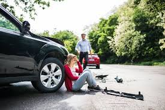

### Result on Selected Transportation Scene Images

#### Test Samples 
1. Sample1: 用300个字左右描述一下图中发生了什么场景，可能是由于什么导致的，并且给出对应的处置建议.
   
   **QWEN Result:**
   图中显示了一起交通事故的场景。一辆黑色轿车和一辆红色卡车相撞，轿车的前部受损严重，车头部分被撞变形，车内的安全气囊已经弹出。卡车的车头部分也有明显的碰撞痕迹。现场有几个人在查看事故情况，其中一人穿着白色衬衫，似乎在与其他人交流。\n\n这起事故可能是由于多种原因导致的，例如驾驶员注意力不集中、疲劳驾驶、酒驾、超速行驶、违反交通规则等。此外，也有可能是由于卡车和轿车的视线盲区或视线不佳导致的。\n\n对于这种事故，首先应该立即报警，让交警前来处理事故。同时，应该立即拨打急救电话，将受伤人员送往医院进行救治。在等待救援人员到来的过程中，应该保持现场的秩序，避免二次事故的发生。此外，驾驶员应该配合交警的调查，提供相关的证据和信息，以便于事故责任的认定和处理。

2. Sample2: 用300个字左右描述一下图中发生了什么场景，可能是由于什么导致的，并且给出对应的处置建议.
   
   **QWEN Result:**
    '图中显示了一起交通事故的场景。一辆摩托车和一辆汽车相撞，摩托车倒在地上，车头受损严重，而汽车则停在了摩托车旁边，车头也有明显的碰撞痕迹。周围的车辆和行人似乎在等待交通信号灯的变化，以避免进一步的拥堵和混乱。\n\n这起事故可能是由于摩托车驾驶员没有遵守交通规则，比如闯红灯、超速或在交叉路口没有让行造成的。也有可能是汽车驾驶员没有及时避让摩托车，导致了碰撞。无论原因是什么，这起事故都提醒我们，遵守交通规则和保持警惕是避免交通事故的关键。\n\n对于处置建议，首先，现场的驾驶员应该立即停车，确保自己和他人的安全。然后，他们应该立即报警，并通知急救服务，以确保任何受伤的人都能得到及时的医疗援助。此外，他们还应该提供必要的信息，如事故的详细情况、车辆的详细信息以及任何可能的目击者。最后，他们应该等待警方和急救人员到达现场，以便进行进一步的处理和调查。

3. Sample3: 用300个字左右描述一下图中发生了什么场景，可能是由于什么导致的，并且给出对应的处置建议.
   
   **QWEN Result:**
   图中显示了一起交通事故，一辆小型货车与一辆白色轿车相撞。从图片中可以看出，小型货车的前部与白色轿车的后部发生了碰撞，导致小型货车的前部受损，白色轿车的后部也受到了一定的损伤。事故现场周围没有明显的交通标志或信号灯，可能是由于驾驶员在交叉路口没有遵守交通规则或注意力不集中导致的。\n\n处置建议：\n1. 立即拨打紧急电话，通知警察和急救人员到场处理事故。\n2. 将车辆移至安全地带，避免交通堵塞和二次事故的发生。\n3. 保护事故现场，等待警方进行调查和处理。\n4. 如果有人受伤，立即提供必要的急救措施，并协助伤者就医。\n5. 与保险公司联系，处理保险理赔事宜。\n6. 在事故处理过程中，保持冷静，不要与对方发生争执或冲突。\n7. 在事故处理完成后，及时向相关部门报告事故情况，以便进行后续处理。

4. Sample4: 用300个字左右描述一下图中发生了什么场景，可能是由于什么导致的，并且给出对应的处置建议.
    
   **QWEN Result:**
   '图中显示了一辆白色轿车在路边发生了一起事故。车辆的前部受损严重，车头部分凹陷，引擎盖和前保险杠有明显的碰撞痕迹。事故现场有两名穿着反光背心的工作人员在查看情况，旁边还有一辆黑色的轿车停在路边，可能是事故的另一方车辆。\n\n从图片中可以看出，事故可能是由于驾驶员在行驶过程中没有注意前方路况，或者在转弯时没有及时减速，导致车辆失控撞向路边的护栏或障碍物。此外，事故现场的路标提示“事故易发，路口注意减速慢行”，也表明该路段可能存在视线不佳或交通流量较大的情况，增加了发生事故的风险。\n\n针对这种情况，建议驾驶员在行驶过程中保持警惕，注意观察前方路况，尤其是在视线不佳或交通流量较大的路段，要提前减速并保持安全距离。同时，驾驶员应遵守交通规则，尤其是在路口或转弯处要减速慢行，以确保自身和他人的安全。此外，车辆的所有者或驾驶员应定期对车辆进行检查和维护，确保车辆处于良好的工作状态，以减少因车辆故障导致的事故风险。

5. Sample5: 用300个字左右描述一下图中发生了什么场景，可能是由于什么导致的，并且给出对应的处置建议.
   
   **QWEN Result:**
   '图中显示了一辆混凝土搅拌车在道路上倾倒混凝土，导致交通堵塞。可能的原因是司机在操作过程中失误，或者车辆故障导致混凝土意外倾倒。此外，也可能是由于道路施工或维修工作，导致车辆无法正常行驶，从而引发交通堵塞。\n\n针对这种情况，建议采取以下措施：\n\n1. 立即通知相关部门，如交通管理部门和混凝土搅拌车的运营商，以确保安全和秩序。\n2. 尽快清理现场，将混凝土和车辆移至安全地带，以减少对交通的影响。\n3. 对于交通堵塞，可以采取临时交通管制措施，如设置临时交通信号灯或引导车辆绕行，以缓解交通压力。\n4. 对于混凝土搅拌车的司机，应进行安全教育和培训，提高其操作技能和安全意识，避免类似事件再次发生。\n5. 对于道路施工或维修工作，应提前做好规划和安排，确保施工过程中的安全和交通畅通。\n\n总之，面对此类突发事件，应迅速采取措施，确保人员安全和交通畅通，同时加强安全管理，预防类似事件再次发生。
   
6. Sample6: 用300个字左右描述一下图中发生了什么场景，可能是由于什么导致的，并且给出对应的处置建议.
   
   **QWEN Result:**
   图中显示了一起严重的交通事故，多辆车相撞，其中一辆车的车头严重受损，车头部分几乎完全变形，车灯和前保险杠都脱落了。事故现场周围有救护车和交通信号灯，表明这是一起需要紧急救援的事故。事故可能是由于驾驶员的疏忽或注意力不集中导致的，例如超速、酒驾、疲劳驾驶或分心驾驶等。此外，也有可能是由于道路条件不佳或天气因素导致的。\n\n对于这样的事故，首先应该立即拨打紧急电话，通知救护车和警察到场处理。同时，应该确保现场的安全，避免二次事故的发生。如果有人受伤，应该立即提供急救，并等待专业医疗人员的到来。在等待救援的过程中，应该尽量保持冷静，不要随意移动受伤人员，以免造成更大的伤害。此外，应该尽快联系保险公司，以便进行事故的处理和赔偿。最后，应该配合警方的调查，提供事故现场的证据和信息，以便找出事故的原因，并采取相应的预防措施，避免类似事故的再次发生。

7. Sample7: 用300个字左右描述一下图中发生了什么场景，可能是由于什么导致的，并且给出对应的处置建议.
   
   **QWEN Result:**
   图中显示了一起交通事故现场。一辆黑色轿车和一辆白色皮卡车相撞，轿车侧翻在路面上，周围散落着一些碎片和衣物。现场有几名警察和工作人员在处理事故，其中一名警察正在查看现场情况。\n\n可能的原因：\n1. **速度过快**：轿车可能因速度过快而无法及时刹车，导致与皮卡车相撞。\n2. **视线不佳**：可能是因为天气原因（如雨天或雾天）导致视线不佳，驾驶员未能及时发现前方的车辆。\n3. **疲劳驾驶**：驾驶员可能因疲劳驾驶而反应迟钝，未能及时采取措施避免事故。\n\n处置建议：\n1. **立即报警**：确保所有相关人员立即报警，以便警方能够迅速到达现场进行调查和处理。\n2. **疏散现场**：确保现场周围的安全，疏散无关人员，避免二次事故的发生。\n3. **急救措施**：如果有人受伤，立即进行急救措施，并拨打急救电话。\n4. **保护现场**：在警方到达之前，不要移动任何物品或人员，以保持现场的原始状态，以便警方进行调查。\n5. **配合调查**：在警方到达后，积极配合调查，提供必要的信息和协助。\n\n通过这些措施，可以有效地处理交通事故，减少损失和伤害，并确保道路安全。

8.  Sample8: 用300个字左右描述一下图中发生了什么场景，可能是由于什么导致的，并且给出对应的处置建议.
    
   **QWEN Result:**
   图中显示了一起严重的交通事故，多辆汽车在道路上相撞，现场混乱。从图片中可以看到，至少有三辆车严重受损，其中一辆车的车头部分被撞得严重变形，另一辆车的车尾部分也受损严重。此外，还有几辆车的车头部分受损，车灯和前保险杠等部件脱落。现场有多名行人和车辆驾驶员在查看事故现场，似乎在等待救援人员的到来。\n\n这起事故可能是由于驾驶员的疏忽大意或注意力不集中导致的。例如，驾驶员可能在行驶过程中分心，没有注意到前方的车辆或交通信号，从而引发了事故。此外，驾驶员可能没有遵守交通规则，如超速、闯红灯或不按规定行驶等，这也可能是导致事故的原因之一。\n\n对于这样的事故，首先应该立即拨打急救电话，通知警方和救援人员前来处理。同时，驾驶员应该立即停车，打开危险警告灯，并在安全距离外设置警示标志，以防止其他车辆发生二次事故。此外，驾驶员还应该检查车辆的损伤情况，确保自己和乘客的安全。最后，驾驶员应该配合警方的调查，提供事故现场的证据，以便于事故责任的认定和处理。

9.  Sample9: 用300个字左右描述一下图中发生了什么场景，可能是由于什么导致的，并且给出对应的处置建议.
    
   **QWEN Result:**
   图中展示了一起交通事故的场景。一名女子坐在地上，似乎受伤了，旁边有一辆黑色的汽车和一辆红色的汽车。两辆车的后部都受损，地上散落着一些碎片。这可能是一起追尾事故，可能是由于驾驶者没有保持足够的安全距离，或者在驾驶过程中分心导致的。\n\n对于这种事故，首先应该确保所有人的安全，如果有人受伤，应该立即拨打急救电话。然后，应该检查车辆的损坏情况，如果车辆无法移动，应该使用三角警示牌或其他警示设备来警告其他车辆。接下来，应该联系保险公司和警方，报告事故并填写事故报告。最后，应该收集所有相关的证据，包括照片、视频和目击者的证词，以便在处理保险索赔时使用。
